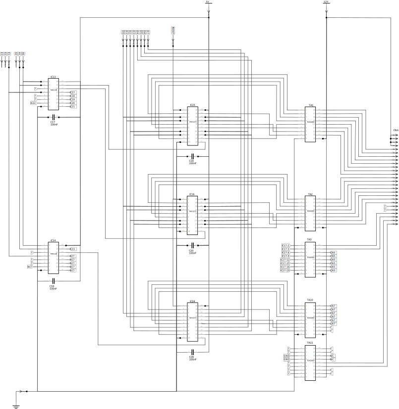

# 表示出力部

## 回路図

2つの74AC138(`IC13`, `IC14`)で4入力(?)16出力のデマルチプレクサを構成し、8回路×10組のDフリップフロップ・74HC273A(`IC15`〜`IC24`)にクロック信号を出力。　10組の74HC273Aで最大8×10ビット分のデータを保持。

74HC273Aの出力は、それぞれに接続されたトランジスタアレイTD62083(`TA1`〜`TA10`)に入力され、同出力はコネクタ`CN4`〜`CN7`を介して直接LEDの点灯に用いられる。

`TA11`は74AC138を独立して実装されているため、個別に制御される(?)

## パーツ

### 74AC138
1/8 デコーダ・デマルチプレクサ

|pin №|symbol|symbol|pin №|
|-----:|:-----|-----:|:-----|
|1|A0|O0|16|
|2|A1|O1|15|
|3|A2|O2|14|
|4|E1|O3|13|
|5|E2|O4|12|
|6|E3|O5|11|
|7|O7|O5|10|
|8|GND|O6|9|

- A0-A2: Address Iputs
- E1, E2, E3: Enable Inputs
- O0-O7: Outputs

|項目|値|
|----|--|
|VCC|2.0〜6.0V|
|VIN, VOUT|0〜VCC|

### 74HC273A
8回路 Dフリップフロップ

|pin №|symbol|symbol|pin №|
|-----:|:-----|-----:|:-----|
|1|CLR|VCC|20|
|2|Q1|Q8|19|
|3|D1|D8|18|
|4|D2|D7|17|
|5|Q2|Q7|16|
|6|Q3|Q6|15|
|7|D3|D6|14|
|8|D4|D5|13|
|9|Q4|Q5|12|
|10|GND|CK|11|

|項目|値|
|----|--|
|VCC|2〜6V|
|VIN|0〜VCC|
|VOUT|0〜VCC|
|ICC|±50mA max|
|IOUT|±25mA max|

### TD62083
8ch シンクドライバ トランジスタアレイ

|pin №|symbol|symbol|pin №|
|-----:|:-----|-----:|:-----|
|1|I1|O1|18|
|2|I2|O2|17|
|3|I3|O3|16|
|4|I4|O4|15|
|5|I5|O5|14|
|6|I6|O6|13|
|7|I7|O7|12|
|8|I8|O8|11|
|9|GND|COMMON|10|

|項目|値|
|----|--|
|VOUT|50V|
|VCOM|〜50V|
|IOUT|500mA/ch|
|VIN|〜30V|
