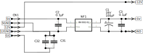

# 電源・フィルタ部

## 回路図

- 5VラインはEMIフィルタを経由する
- 12Vラインは直接そのまま

## パーツ
### EMIフィルタ
村田製作所 BNX 002-01
|項目|値|
|----|--|
|定格電流|10A|
|定格電圧|50VDC|
|耐電圧|125VDC|
|絶縁抵抗|100MΩ|

類似品: BNX 012-01
|項目|値|
|----|--|
|定格電流|15A|
|定格電圧|50VDC|
|耐電圧|125VDC|
|絶縁抵抗|500MΩ|
